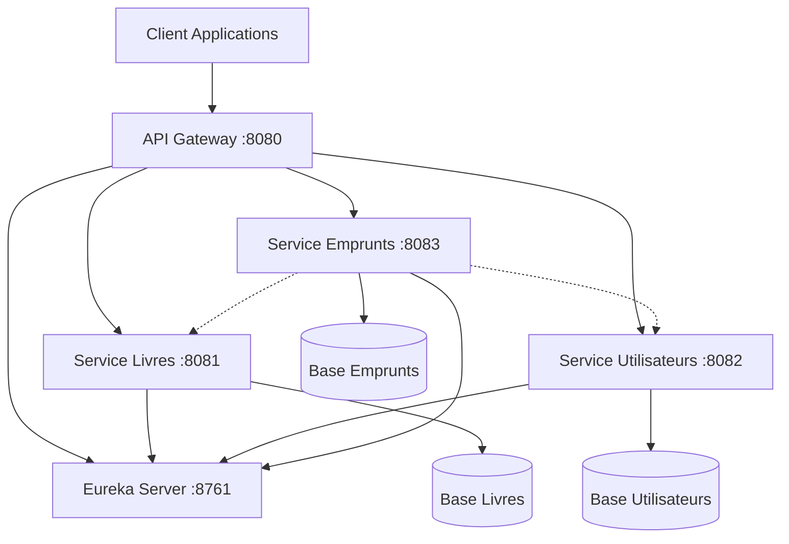

# Document de Conception - Système de Gestion de Bibliothèque

## Vue d'ensemble

Le système de gestion de bibliothèque est conçu comme une architecture microservices utilisant Spring Boot et Spring Cloud. L'architecture comprend trois microservices métier (Livres, Utilisateurs, Emprunts), un API Gateway pour le routage et la sécurité, et un serveur Eureka pour la découverte de services. La sécurité est assurée par JWT avec Spring Security.

## Architecture

### Architecture Globale



### Patterns Architecturaux

- **API Gateway Pattern** : Point d'entrée unique pour tous les clients
- **Service Discovery Pattern** : Découverte automatique des services via Eureka
- **Database per Service** : Chaque microservice a sa propre base de données
- **Circuit Breaker** : Protection contre les défaillances en cascade
- **JWT Token Pattern** : Authentification stateless

## Composants et Interfaces

### 1. API Gateway (Port 8080)

**Responsabilités :**
- Routage des requêtes vers les microservices appropriés
- Authentification et autorisation JWT
- Limitation de débit (Rate Limiting)
- Gestion des CORS
- Logging et monitoring centralisé

**Configuration des Routes :**
```yaml
spring:
  cloud:
    gateway:
      routes:
        - id: book-service
          uri: lb://book-service
          predicates:
            - Path=/api/books/**
        - id: user-service
          uri: lb://user-service
          predicates:
            - Path=/api/users/**
        - id: loan-service
          uri: lb://loan-service
          predicates:
            - Path=/api/loans/**
```

### 2. Service Livres (Port 8081)

**API REST :**
- `GET /api/books` - Lister tous les livres
- `GET /api/books/{id}` - Obtenir un livre par ID
- `GET /api/books/search?query={query}` - Rechercher des livres
- `POST /api/books` - Créer un nouveau livre
- `PUT /api/books/{id}` - Mettre à jour un livre
- `DELETE /api/books/{id}` - Supprimer un livre
- `GET /api/books/{id}/availability` - Vérifier la disponibilité

### 3. Service Utilisateurs (Port 8082)

**API REST :**
- `POST /api/users/register` - Inscription d'un nouvel utilisateur
- `POST /api/users/login` - Authentification et génération JWT
- `GET /api/users/profile` - Profil utilisateur (authentifié)
- `PUT /api/users/profile` - Mise à jour du profil
- `GET /api/users/{id}` - Obtenir un utilisateur (admin)
- `GET /api/users/search?query={query}` - Rechercher des utilisateurs (admin)

### 4. Service Emprunts (Port 8083)

**API REST :**
- `POST /api/loans` - Créer un nouvel emprunt
- `PUT /api/loans/{id}/return` - Retourner un livre
- `GET /api/loans/user/{userId}` - Emprunts d'un utilisateur
- `GET /api/loans/book/{bookId}` - Emprunts d'un livre
- `GET /api/loans/overdue` - Emprunts en retard
- `GET /api/loans/{id}` - Détails d'un emprunt

### 5. Eureka Server (Port 8761)

**Responsabilités :**
- Enregistrement des microservices
- Découverte de services
- Health checking
- Load balancing information

## Modèles de Données

### Entité Livre
```java
@Entity
public class Livre {
    @Id
    @GeneratedValue(strategy = GenerationType.IDENTITY)
    private Long id;
    
    @NotBlank
    @Size(max = 255)
    private String titre;
    
    @NotBlank
    @Size(max = 255)
    private String auteur;
    
    @NotBlank
    @Size(max = 100)
    private String categorie;
    
    @NotBlank
    @Pattern(regexp = "^(?:ISBN(?:-1[03])?:? )?(?=[0-9X]{10}$|(?=(?:[0-9]+[- ]){3})[- 0-9X]{13}$|97[89][0-9]{10}$|(?=(?:[0-9]+[- ]){4})[- 0-9]{17}$)(?:97[89][- ]?)?[0-9]{1,5}[- ]?[0-9]+[- ]?[0-9]+[- ]?[0-9X]$")
    private String isbn;
    
    @CreationTimestamp
    private LocalDateTime dateCreation;
    
    @UpdateTimestamp
    private LocalDateTime dateModification;
}
```

### Entité Utilisateur
```java
@Entity
public class Utilisateur {
    @Id
    @GeneratedValue(strategy = GenerationType.IDENTITY)
    private Long id;
    
    @NotBlank
    @Size(max = 100)
    private String nom;
    
    @NotBlank
    @Email
    @Column(unique = true)
    private String email;
    
    @NotBlank
    @Size(max = 255)
    private String adresse;
    
    @NotBlank
    @Pattern(regexp = "^[+]?[0-9]{10,15}$")
    private String telephone;
    
    @NotBlank
    private String motDePasse; // BCrypt hashed
    
    @Enumerated(EnumType.STRING)
    private Role role = Role.USER;
    
    @CreationTimestamp
    private LocalDateTime dateInscription;
}
```

### Entité Emprunt
```java
@Entity
public class Emprunt {
    @Id
    @GeneratedValue(strategy = GenerationType.IDENTITY)
    private Long id;
    
    @NotNull
    private Long utilisateurId;
    
    @NotNull
    private Long livreId;
    
    @NotNull
    private LocalDate dateEmprunt;
    
    private LocalDate dateRetourPrevue;
    
    private LocalDate dateRetourEffective;
    
    @Enumerated(EnumType.STRING)
    private StatutEmprunt statut = StatutEmprunt.ACTIF;
    
    @CreationTimestamp
    private LocalDateTime dateCreation;
}
```
## Propriétés de Correction

*Une propriété est une caractéristique ou un comportement qui doit être vrai dans toutes les exécutions valides d'un système - essentiellement, une déclaration formelle sur ce que le système doit faire. Les propriétés servent de pont entre les spécifications lisibles par l'homme et les garanties de correction vérifiables par machine.*

### Propriétés du Service Livres

**Propriété 1: Création complète des livres**
*Pour tout* livre créé, l'enregistrement doit contenir tous les champs obligatoires : id, titre, auteur, catégorie et ISBN
**Valide: Exigences 1.1**

**Propriété 2: Persistance des modifications**
*Pour tout* livre modifié, les nouvelles données doivent être sauvegardées et l'historique des modifications doit être conservé
**Valide: Exigences 1.2**

**Propriété 3: Recherche exhaustive**
*Pour toute* requête de recherche par titre ou auteur, tous les livres correspondants doivent être retournés avec leurs informations complètes
**Valide: Exigences 1.3**

**Propriété 4: Protection contre suppression**
*Pour tout* livre ayant des emprunts actifs, la tentative de suppression doit être rejetée
**Valide: Exigences 1.4**

**Propriété 5: Validation ISBN**
*Pour tout* ISBN soumis, le système doit valider qu'il respecte le format standard international
**Valide: Exigences 1.5**

### Propriétés du Service Utilisateurs

**Propriété 6: Création complète des utilisateurs**
*Pour tout* utilisateur créé, l'enregistrement doit contenir tous les champs obligatoires : id, nom, email, adresse et téléphone
**Valide: Exigences 2.1**

**Propriété 7: Validation des mises à jour**
*Pour toute* mise à jour d'informations utilisateur, les données doivent être validées avant sauvegarde
**Valide: Exigences 2.2**

**Propriété 8: Recherche d'utilisateurs**
*Pour toute* recherche d'utilisateur par nom ou email, tous les utilisateurs correspondants doivent être retournés
**Valide: Exigences 2.3**

**Propriété 9: Génération JWT valide**
*Pour toute* authentification réussie, un JWT_Token valide doit être généré
**Valide: Exigences 2.4**

**Propriété 10: Validation email et unicité**
*Pour tout* email soumis, le format doit être valide et l'adresse doit être unique dans le système
**Valide: Exigences 2.5**

### Propriétés du Service Emprunts

**Propriété 11: Création complète des emprunts**
*Pour tout* emprunt créé, l'enregistrement doit contenir utilisateur_id, livre_id et date_emprunt
**Valide: Exigences 3.1**

**Propriété 12: Mise à jour du retour**
*Pour tout* livre retourné, l'enregistrement d'emprunt doit être mis à jour avec la date_retour
**Valide: Exigences 3.2**

**Propriété 13: Calcul de période d'emprunt**
*Pour tout* emprunt créé, la date de retour prévue doit être fixée à 14 jours après la date d'emprunt
**Valide: Exigences 3.3**

**Propriété 14: Rejet des emprunts indisponibles**
*Pour tout* livre déjà emprunté, toute nouvelle tentative d'emprunt doit être rejetée
**Valide: Exigences 3.4**

**Propriété 15: Détection des retards**
*Pour tout* emprunt dépassant la date de retour prévue, le statut doit être marqué comme en retard
**Valide: Exigences 3.5**

### Propriétés de Sécurité

**Propriété 16: Validation JWT**
*Pour toute* requête avec JWT_Token, le token doit être validé avant traitement
**Valide: Exigences 4.2**

**Propriété 17: Headers de corrélation**
*Pour toute* requête traitée par l'API_Gateway, les headers de corrélation doivent être ajoutés
**Valide: Exigences 4.4**

**Propriété 18: Limitation de débit**
*Pour tout* utilisateur, les requêtes doivent respecter les limites de débit configurées
**Valide: Exigences 4.5**

**Propriété 19: Expiration JWT**
*Pour tout* JWT_Token généré, il doit avoir une durée de validité limitée
**Valide: Exigences 6.1**

**Propriété 20: Rejet des tokens expirés**
*Pour tout* JWT_Token expiré, les requêtes utilisant ce token doivent être rejetées
**Valide: Exigences 6.2**

**Propriété 21: Autorisation basée sur les rôles**
*Pour tout* accès à une ressource protégée, les permissions doivent être vérifiées selon les rôles dans le JWT_Token
**Valide: Exigences 6.4**

**Propriété 22: Hachage des mots de passe**
*Pour tout* mot de passe stocké, il doit être haché avec BCrypt et jamais stocké en clair
**Valide: Exigences 6.5**

### Propriétés de Monitoring

**Propriété 23: Logging des anomalies**
*Pour toute* anomalie détectée, un événement doit être enregistré dans les logs avec le niveau approprié
**Valide: Exigences 7.2**

**Propriété 24: Traçage distribué**
*Pour toute* requête traversant le système, chaque composant doit ajouter des informations de traçage
**Valide: Exigences 7.3**
## Gestion d'Erreurs

### Stratégies de Gestion d'Erreurs

**1. Validation des Données**
- Validation côté client et serveur
- Messages d'erreur explicites et localisés
- Codes d'erreur standardisés

**2. Gestion des Exceptions**
```java
@ControllerAdvice
public class GlobalExceptionHandler {
    
    @ExceptionHandler(ValidationException.class)
    public ResponseEntity<ErrorResponse> handleValidation(ValidationException ex) {
        return ResponseEntity.badRequest()
            .body(new ErrorResponse("VALIDATION_ERROR", ex.getMessage()));
    }
    
    @ExceptionHandler(ResourceNotFoundException.class)
    public ResponseEntity<ErrorResponse> handleNotFound(ResourceNotFoundException ex) {
        return ResponseEntity.notFound().build();
    }
    
    @ExceptionHandler(BusinessRuleException.class)
    public ResponseEntity<ErrorResponse> handleBusinessRule(BusinessRuleException ex) {
        return ResponseEntity.badRequest()
            .body(new ErrorResponse("BUSINESS_RULE_VIOLATION", ex.getMessage()));
    }
}
```

**3. Circuit Breaker Pattern**
- Protection contre les défaillances en cascade
- Fallback mechanisms pour les services indisponibles
- Monitoring des états des circuits

**4. Retry Logic**
- Retry automatique pour les erreurs transitoires
- Backoff exponentiel
- Limite du nombre de tentatives

## Stratégie de Test

### Approche de Test Dual

Le système utilisera une approche de test combinant les tests unitaires et les tests basés sur les propriétés :

**Tests Unitaires :**
- Vérification d'exemples spécifiques et de cas limites
- Tests d'intégration entre composants
- Validation des points d'entrée et de sortie

**Tests Basés sur les Propriétés :**
- Vérification des propriétés universelles sur tous les inputs
- Utilisation de **JUnit 5** avec **jqwik** pour les tests basés sur les propriétés
- Configuration minimale de **100 itérations** par test de propriété
- Chaque test de propriété doit être tagué avec le format : **'Feature: bibliotheque-microservices, Property {number}: {property_text}'**

### Framework de Test

**Bibliothèque de Test Basé sur les Propriétés :** jqwik pour Java
```xml
<dependency>
    <groupId>net.jqwik</groupId>
    <artifactId>jqwik</artifactId>
    <version>1.7.4</version>
    <scope>test</scope>
</dependency>
```

**Configuration des Tests de Propriétés :**
```java
@Property(tries = 100)
@Label("Feature: bibliotheque-microservices, Property 1: Création complète des livres")
void testLivreCreationComplete(@ForAll @ValidLivre Livre livre) {
    // Test implementation
}
```

### Couverture de Test

**Tests Unitaires couvrent :**
- Validation des données d'entrée
- Logique métier spécifique
- Gestion d'erreurs
- Intégration avec les bases de données

**Tests de Propriétés couvrent :**
- Invariants du système
- Propriétés de round-trip (sérialisation/désérialisation)
- Propriétés de cohérence des données
- Validation des règles métier sur tous les inputs possibles

### Environnement de Test

**Base de Données de Test :**
- H2 en mémoire pour les tests unitaires
- TestContainers pour les tests d'intégration

**Configuration de Test :**
```yaml
spring:
  profiles:
    active: test
  datasource:
    url: jdbc:h2:mem:testdb
    driver-class-name: org.h2.Driver
  jpa:
    hibernate:
      ddl-auto: create-drop
```

**Mocking et Stubbing :**
- Mockito pour les dépendances externes
- WireMock pour simuler les appels entre microservices
- TestContainers pour les tests d'intégration complets