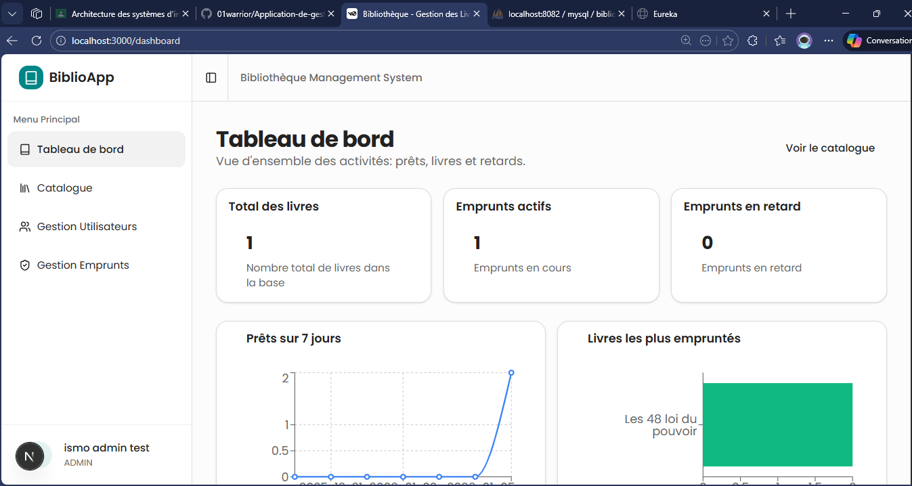

# Système de Gestion de Bibliothèque - Microservices



Ce projet est mon projet final de formation sur Spring, une application de gestion de bibliothèque basée sur une architecture microservices avec Spring Boot et Spring Cloud ou nous avons eu a explorer les microservices, utilisé eureka pour la decouverte le tout centralisé en un seul point d'entré via apiGateway securisé avec JWT et RBAC(Role-Based Access Control) avec evidemment Les routes publiques comme /login et /register exemptées.

## Architecture.

L'application est composée des services suivants :

| Service           | Port   | Description                                                               |
| ----------------- | ------ | ------------------------------------------------------------------------- |
| **Eureka Server** | `8761` | Serveur de découverte de services                                         |
| **API Gateway**   | `8080` | Point d'entrée unique, routage, **sécurité JWT, Rate Limiting & Tracing** |
| **Book Service**  | `8081` | Gestion des livres (CRUD)                                                 |
| **User Service**  | `8082` | Gestion des utilisateurs, rôles et authentification JWT                   |
| **Loan Service**  | `8083` | Gestion des emprunts et retours                                           |

## Démarrage

Ordre de démarrage que nous que j'ai priorisé :

1. Eureka Server
2. User Service / Book Service / Loan Service
3. API Gateway

---

## Sécurité et Fonctionnalités Gateway (Nouveau)

L'API Gateway (`http://localhost:8080`) intègre désormais les fonctionnalités suivantes :

1.  **Authentification JWT** : Validation des tokens pour toutes les routes sécurisées.
2.  **Autorisation par Rôle (RBAC)** :
    - `ADMIN` : Accès complet (CRÉATION/MODIFICATION/SUPPRESSION sur `/api/books` et `/api/users`).
    - `USER` : Accès lecture et emprunts.
3.  **Rate Limiting** : Limite le nombre de requêtes par utilisateur (ou IP) pour éviter les abus.
4.  **Traçage Distribué** : Ajout automatique d'un header `X-Correlation-ID` pour suivre les requêtes à travers les microservices.

---

## Documentation API & Tests

Toutes les requêtes doivent passer par l'API Gateway (`http://localhost:8080`).

### Guide de Test "Réel"

Voici comment tester les nouvelles fonctionnalités qui sont implémentées.

#### 1. Authentification & Récupération du Token

Pour interagir avec l'API, vous devez d'abord obtenir un token.

**Inscription (USER par défaut)**

```bash
curl -X POST http://localhost:8080/api/users/register \
  -H "Content-Type: application/json" \
  -d '{"nom":"Jean User","email":"user@test.com","adresse":"Casa","telephone":"0600000000","motDePasse":"password123", "role":"USER"}'
```

**Connexion (Récupérez le `accessToken` de la réponse)**

```bash
curl -X POST http://localhost:8080/api/users/login \
  -H "Content-Type: application/json" \
  -d '{"email":"user@test.com","motDePasse":"password123"}'
```

_Copiez le token reçu pour les étapes suivantes._

#### 2. Test du Contrôle d'Accès (RBAC)

**Tentative de création de livre en tant que simple USER ( échoue et normal expressement fait : 403 Forbidden)**

```bash
curl -X POST http://localhost:8080/api/books \
  -H "Authorization: Bearer VOTRE_TOKEN_USER" \
  -H "Content-Type: application/json" \
  -d '{"titre":"Livre Interdit","auteur":"Inconnu","categorie":"Divers","isbn":"978-0-000-00000-0"}'
```

**Création en tant qu'ADMIN**
_(Il faut d'abord créer un utilisateur avec le rôle ADMIN en base de données ou via l'inscription si autorisé)_

```bash
curl -X POST http://localhost:8080/api/books \
  -H "Authorization: Bearer VOTRE_TOKEN_ADMIN" \
  -H "Content-Type: application/json" \
  -d '{"titre":"Spring Security","auteur":"Expert","categorie":"Tech","isbn":"978-1-111-11111-1"}'
```

#### 3. Test du Rate Limiting

La Gateway limite le nombre de requêtes (ex: 10 req/min). Lancez cette commande en boucle pour voir le blocage.

```bash
for i in {1..15}; do curl -I -X GET http://localhost:8080/api/books; done
```

_Après 10 requêtes, vous devriez recevoir une erreur **429 Too Many Requests**._

#### 4. Vérification du Correlation ID

Chaque réponse contient désormais un identifiant unique de traçage.

```bash
curl -I -X GET http://localhost:8080/api/books
```

_Regardez le header de réponse : `X-Correlation-ID: xxxxx-xxxx-xxxx...`_

---

### Endpoints Principaux

#### Service Utilisateurs

- `POST /api/users/register` : Inscription (Public)
- `POST /api/users/login` : Connexion (Public)
- `GET /api/users/profile` : Profil (Sécurisé)

#### Service Livres

- `GET /api/books` : Liste des livres (Public/Sécurisé selon config)
- `POST /api/books` : Ajouter un livre (**ADMIN uniquement**)
- `GET /api/books/search?query=...` : Recherche

#### Service Emprunts

- `POST /api/loans` : Emprunter un livre
- `PUT /api/loans/{id}/return` : Retourner un livre
- `GET /api/loans/user/{userId}` : Historique

---

## Notes Techniques

- **Audit** : La fonctionnalité d'audit (Hibernate Envers) a été désactivée sur `BookService` pour alléger le service.
- **Base de données** : Chaque service utilise sa propre base de données (H2 en test ou MySQL en prod).
